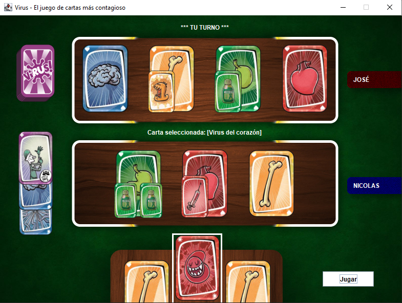
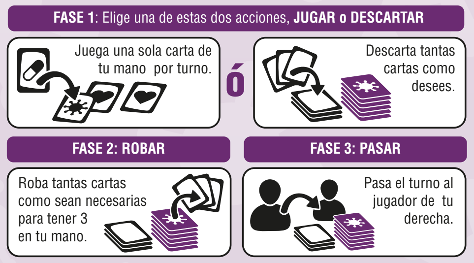
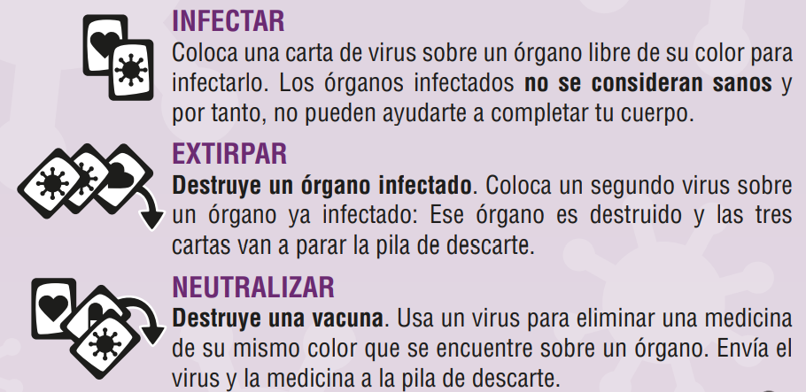
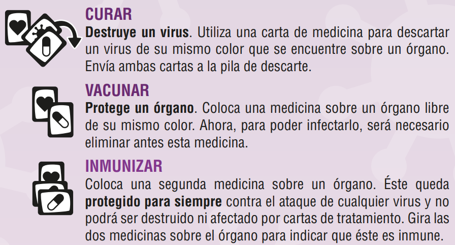

# Virus! El juego de cartas más contagioso.

## Descripción

- Videojuego de cartas realizado en Java, utilizando el patrón MVC, Observer y RMI.
- Para 2 jugadores (Se puede jugar de forma local entre dos equipos conectados a la misma red local, o
desde el mismo equipo).
- Posee dos vistas independientes, **VistaConsola** y **VistaGráfica** que se pueden elegir 
antes de que inicie el juego.

## Preparación

1)  Para ejecutar el juego, primero hay que iniciar **AppServidor**, indicando la **dirección IP** en la que 
se hosteará el servidor, y también su **puerto** (Por ejemplo, IP: 127.0.0.1, Puerto: 8888).
2) Una vez hosteado el servidor, debe ejecutar **AppCliente** para iniciar el juego. Ambos jugadores
deben ejecutar AppCliente para poder conectarse con el servidor host. Aquí se debe seleccionar la IP en la que
usted como cliente escuchará las peticiones, luego debe colocar el **puerto**, **la dirección IP** en la que se está ejecutando
el **servidor host**, **el puerto** en el que está corriendo el **servidor** y por último, si desea jugar en **vistaConsola** o **vistaGráfica** (Por ejemplo, IP cliente: 127.0.0.1, Puerto cliente: 9999, IP servidor: 127.0.0.1, Puerto servidor: 8888).
3) Una vez realizada la configuración necesaria para poder conectarse entre jugadores y el servidor, se abrirá la ventana
elegida, ya sea vista gráfica o vista consola.
4) Aquí tendrá varias opciones:
    1) **Ingresar su nombre en el input que está debajo** y hacer click en **Confirmar**. Deberá esperar a que el otro jugador también haga lo mismo.
   2) Botón **Cargar partida**: Si previamente se jugó una partida que no se terminó por completo (es decir, se cerró la partida
   en curso), tendrá la opción de **reanudarla**, pero el otro jugador también debe hacer lo mismo para confirmar esta acción de reanudar la partida.
   3) Botón **Ver Reglas**: Permite ver las reglas del juego.
   4) Botón **Ver ganadores**: Permite ver el historial de las partidas jugadas y los nombres de los jugadores que ganaron y perdieron en cada una, junto con el día 
   y horario que se jugó.
5) Una vez que **ambos jugadores están listos** (ambos colocaron su nombre o ambos solicitaron reanudar la partida), **la partida comienza**.
6) Al comenzar, se repartirán **3 cartas a cada jugador**. En ambas vistas, en la parte superior está el cuerpo (mesa) del rival, y debajo la del jugador actual.
En la vista gráfica, a la izquierda, se pueden ver cuántas cartas quedan en el mazo y también las últimas 3 cartas descartadas.
7) Una vez que un jugador gana, se puede jugar **revancha** si ambos jugadores están de acuerdo.

## Objetivo del juego

Las **cartas de órganos** son las principales del juego, ya que si se tienen las 4 cartas de órganos diferentes en mesa
  sin ninguna infección, se consigue **ganar el juego**.

## Mecánica del juego

Cada jugador tiene siempre al comienzo de su turno 3 cartas en mano, y sólo podrá realizar una acción por turno.

Despues de haber jugado, robará cartas del mazo para volver a tener su mano completa.

Juega los distintos tipos de carta, colocándolas sobre la mesa frente a ti para
  construir tu cuerpo, o sobre las cartas de tus rivales para evitar que éstos lo
  logren antes que tú.

Algunas cartas (las de tratamiento) pueden obligarte a descartar o cambiar tus órganos, tus vacunas
  o incluso tu mano. Elabora tu estrategia para ser el primero en formar tu cuerpo
  completo. 
Permanece atento a las jugadas de los demás, porque tendrás que evitar que el
  resto de jugadores terminen su cuerpo antes que tú.

### Captura de una partida en curso

## Fases del juego

En cada turno, elige entre **jugar una carta o descartar hasta las 3 que tengas en mano**. Una vez realizada una acción,
se robarán las cartas que te falten para volver a tener 3 en mano y pasar el turno al jugador rival.

No se puede pasar el turno sin haber realizado alguna acción.

## Tipos de cartas

### Cartas de órganos (20 en total)

Reúne cuatro órganos sanos de distinto
color para ganar el juego. No puedes tener en tu
cuerpo dos órganos iguales en ningún momento.

| Nombre       | Imágen                                                                                                                                     | Cantidad |
|--------------|--------------------------------------------------------------------------------------------------------------------------------------------|----------|
| **Cerebro**  | 

   | **5**    |
| **Corazón**  | 

   | **5**    |
| **Estómago** | 

 | **5**    |
| **Hueso**    | 

       | **5**    |

### Cartas de virus (16 en total)

Usa las cartas de virus para destruir los órganos y medicinas de tus rivales.
Los virus sólo tienen efecto sobre órganos y medicinas de su mismo color.

| Nombre                 | Imágen                                                                                                                                               | Cantidad |
|------------------------|------------------------------------------------------------------------------------------------------------------------------------------------------|----------|
| **Virus del Cerebro**  | 

   | **4**    |
| **Virus del Corazón**  | 

   | **4**    |
| **Virus del Estómago** | 

 | **4**    |
| **Virus del Hueso**    | 

       | **4**    |

### Cartas de medicinas (16 en total)

Las cartas de medicina sirven para proteger tus órganos de los virus. Pueden
destruir cartas de virus o proteger órganos para evitar que sean infectados. Utiliza
las cartas de medicina sólo sobre cartas (virus u órganos) de su mismo color.

| Nombre                    | Imágen                                                                                                                                                     | Cantidad |
|---------------------------|------------------------------------------------------------------------------------------------------------------------------------------------------------|----------|
| **Medicina del Cerebro**  | 

   | **4**    |
| **Medicina del Corazón**  | 

   | **4**    |
| **Medicina del Estómago** | 

 | **4**    |
| **Medicina del Hueso**    | 

       | **4**    |

### Cartas de tratamientos (4 en total)

Las cartas de tratamiento pueden alterar el juego para ayudarte a ganar.
Utilízalas en tu beneficio o para evitar que tus rivales completen su cuerpo antes
que tú. Estas cartas se juegan sobre la pila de descartes y tienen efecto inmediato.

| Nombre                 | Imágen                                                                                                                                               | Cantidad | Descripcion                                                                                                            |
|------------------------|------------------------------------------------------------------------------------------------------------------------------------------------------|----------|------------------------------------------------------------------------------------------------------------------------|
| **Guante de Látex**    | 

 | **1**    | Descarta la mano de tu rival y le obliga a robar 3 cartas nuevas. Puedes realizar otra acción extra este turno.        |
| **Error médico**       | 

     | **1**    | Intercambia todo tu cuerpo por el del rival, incluyendo órganos, virus y vacunas. También intercambia órganos inmunes. |
| **Contagio**           | 

           | **2**    | Traslada todos los virus que tengan tus órganos infectados a los órganos del rival.                                    |

## UML (Diagrama de clases)

### Referencias:
- **Vista** en color Verde.
- **Controlador** en color Rojo.
- **Modelo** en color Celeste.
- **Clases específicas del modelo** en gris.
- **Serializador** en blanco.
- **Ejecución** en Rosa.
